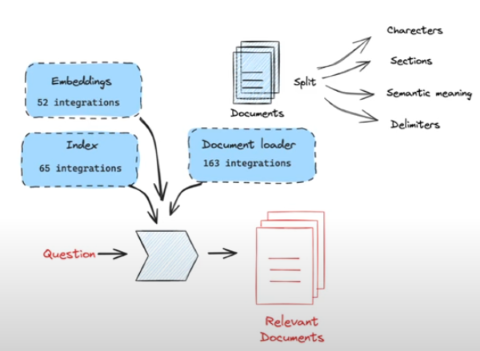
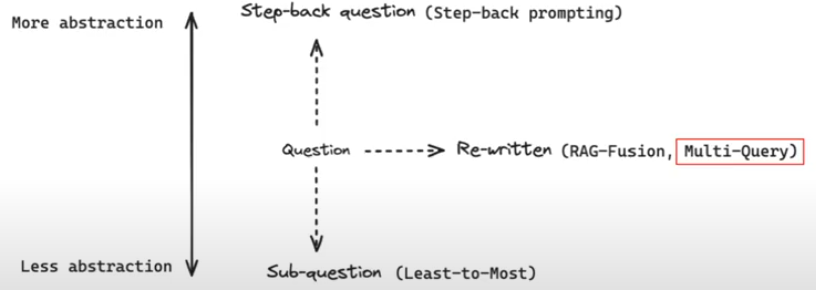

# RAGChatBot - Finance

| Step | Description |
|-|:-|
| **Indexing** | Loading - Splitting - Embedding |
| **Retrieval** | Usually Powered Via Similarity Search |
| **Generation** | Use RAG to generate context-aware answers from retrieved documents.  `rag_chain=({"context":retriever, "question":RunnablePassThrough() pipe prompt pipe llm pipe StrOutputParser() )}).invoke("Hello?")` |
| **QueryTranslation**  |    - `RRF - Reciprocal Rank Fusion`   - `Decomposition`   &nbsp;&nbsp;&nbsp;&nbsp;&nbsp;&nbsp;◦ `IR-CoT` Interleave Retrieval   - `Step-back`   - `HyDE` Generated Document from Question it closer to Actual Documents in Vector Space|
| **QueryConstruction**  | Send Query as PyDantic Object |
| **MultiRepresentationLearning**  | Summarizing the Document first through LLM |
---

**6:09PM August20 2025**
4-5 different forms of Contracts
Contracts will be stored in a BackEnd Folder
Test Cases - Library - ExtractFolder - RealTime
What are SLAs

---
## 📘 References
- [rfs-CodeRepo](https://github.com/langchain-ai/rag-from-scratch/) 
<!-- ## 🚀📂🔍📘✅❌ Icons     -->