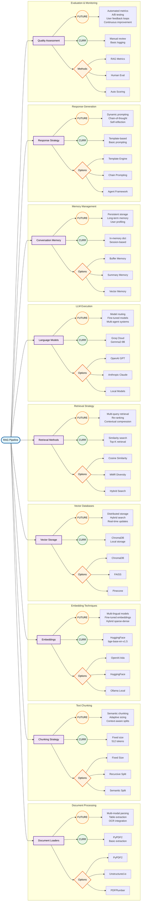

```mermaid
flowchart LR
    START([RAG Pipeline])

    %% ================= Document Processing =================
    subgraph SG_DOC [Document Processing]
        direction LR
        DOC_FUTURE((FUTURE)) --> DOC_FUTURE_TEXT["Multi-modal parsing<br/>Table extraction<br/>OCR integration"]
        H_DOC[Document Loaders]
        DOC_OPT{Options}
        DOC_CURR((CURR)) --> DOC_CURR_TEXT["PyPDF2<br/>Basic extraction"]
        DOC_OPT --> DOC_PYPDF[PyPDF2]
        DOC_OPT --> DOC_UNSTRUCTURED[Unstructured.io]
        DOC_OPT --> DOC_PDFPLUMBER[PDFPlumber]
        H_DOC --> DOC_OPT
        H_DOC --> DOC_CURR
        H_DOC --> DOC_FUTURE
    end

    %% ================= Text Chunking =================
    subgraph SG_CHUNK [Text Chunking]
        direction LR
        CHUNK_FUTURE((FUTURE)) --> CHUNK_FUTURE_TEXT["Semantic chunking<br/>Adaptive sizing<br/>Context-aware splits"]
        H_CHUNK[Chunking Strategy]
        CHUNK_OPT{Options}
        CHUNK_CURR((CURR)) --> CHUNK_CURR_TEXT["Fixed size<br/>512 tokens"]
        CHUNK_OPT --> CHUNK_FIXED[Fixed Size]
        CHUNK_OPT --> CHUNK_RECURSIVE[Recursive Split]
        CHUNK_OPT --> CHUNK_SEMANTIC[Semantic Split]
        H_CHUNK --> CHUNK_OPT
        H_CHUNK --> CHUNK_CURR
        H_CHUNK --> CHUNK_FUTURE
    end

    %% ================= Embeddings =================
    subgraph SG_EMB [Embedding Techniques]
        direction LR
        EMB_FUTURE((FUTURE)) --> EMB_FUTURE_TEXT["Multi-lingual models<br/>Fine-tuned embeddings<br/>Hybrid sparse-dense"]
        H_EMB[Embeddings]
        EMB_OPT{Options}
        EMB_CURR((CURR)) --> EMB_CURR_TEXT["HuggingFace<br/>bge-base-en-v1.5"]
        EMB_OPT --> EMB_OPENAI[OpenAI Ada]
        EMB_OPT --> EMB_HF[HuggingFace]
        EMB_OPT --> EMB_OLLAMA["Ollama Local"]
        H_EMB --> EMB_OPT
        H_EMB --> EMB_CURR
        H_EMB --> EMB_FUTURE
    end

    %% ================= Vector DBs =================
    subgraph SG_VDB [Vector Databases]
        direction LR
        VDB_FUTURE((FUTURE)) --> VDB_FUTURE_TEXT["Distributed storage<br/>Hybrid search<br/>Real-time updates"]
        H_VDB[Vector Storage]
        VDB_OPT{Options}
        VDB_CURR((CURR)) --> VDB_CURR_TEXT["ChromaDB<br/>Local storage"]
        VDB_OPT --> VDB_CHROMA[ChromaDB]
        VDB_OPT --> VDB_FAISS[FAISS]
        VDB_OPT --> VDB_PINECONE[Pinecone]
        H_VDB --> VDB_OPT
        H_VDB --> VDB_CURR
        H_VDB --> VDB_FUTURE
    end

    %% ================= Retrieval Strategy =================
    subgraph SG_RETR [Retrieval Strategy]
        direction LR
        RETR_FUTURE((FUTURE)) --> RETR_FUTURE_TEXT["Multi-query retrieval<br/>Re-ranking<br/>Contextual compression"]
        H_RETR[Retrieval Methods]
        RETR_OPT{Options}
        RETR_CURR((CURR)) --> RETR_CURR_TEXT["Similarity search<br/>Top-K retrieval"]
        RETR_OPT --> RETR_SIMILARITY[Cosine Similarity]
        RETR_OPT --> RETR_MMR[MMR Diversity]
        RETR_OPT --> RETR_HYBRID[Hybrid Search]
        H_RETR --> RETR_OPT
        H_RETR --> RETR_CURR
        H_RETR --> RETR_FUTURE
    end

    %% ================= LLM Execution ==============
    subgraph SG_LLM [LLM Execution]
        direction LR
        LLM_FUTURE((FUTURE)) --> LLM_FUTURE_TEXT["Model routing<br/>Fine-tuned models<br/>Multi-agent systems"]
        H_LLM[Language Models]
        LLM_OPT{Options}
        LLM_CURR((CURR)) --> LLM_CURR_TEXT["Groq Cloud<br/>Gemma2-9B"]
        LLM_OPT --> LLM_GPT["OpenAI GPT"]
        LLM_OPT --> LLM_CLAUDE[Anthropic Claude]
        LLM_OPT --> LLM_LOCAL[Local Models]
        H_LLM --> LLM_OPT
        H_LLM --> LLM_CURR
        H_LLM --> LLM_FUTURE
    end

    %% ================= Memory Management =================
    subgraph SG_MEM [Memory Management]
        direction LR
        MEM_FUTURE((FUTURE)) --> MEM_FUTURE_TEXT["Persistent storage<br/>Long-term memory<br/>User profiling"]
        H_MEM[Conversation Memory]
        MEM_OPT{Options}
        MEM_CURR((CURR)) --> MEM_CURR_TEXT["In-memory dict<br/>Session-based"]
        MEM_OPT --> MEM_BUFFER[Buffer Memory]
        MEM_OPT --> MEM_SUMMARY[Summary Memory]
        MEM_OPT --> MEM_VECTOR[Vector Memory]
        H_MEM --> MEM_OPT
        H_MEM --> MEM_CURR
        H_MEM --> MEM_FUTURE
    end

    %% ================= Response Generation =================
    subgraph SG_RESP [Response Generation]
        direction LR
        RESP_FUTURE((FUTURE)) --> RESP_FUTURE_TEXT["Dynamic prompting<br/>Chain-of-thought<br/>Self-reflection"]
        H_RESP[Response Strategy]
        RESP_OPT{Options}
        RESP_CURR((CURR)) --> RESP_CURR_TEXT["Template-based<br/>Basic prompting"]
        RESP_OPT --> RESP_TEMPLATE[Template Engine]
        RESP_OPT --> RESP_CHAIN[Chain Prompting]
        RESP_OPT --> RESP_AGENT[Agent Framework]
        H_RESP --> RESP_OPT
        H_RESP --> RESP_CURR
        H_RESP --> RESP_FUTURE
    end

    %% ================= Evaluation & Monitoring =================
    subgraph SG_EVAL [Evaluation & Monitoring]
        direction LR
        EVAL_FUTURE((FUTURE)) --> EVAL_FUTURE_TEXT["Automated metrics<br/>A/B testing<br/>User feedback loops<br/>Continuous improvement"]
        H_EVAL[Quality Assessment]
        EVAL_OPT{Methods}
        EVAL_CURR((CURR)) --> EVAL_CURR_TEXT["Manual review<br/>Basic logging"]
        EVAL_OPT --> EVAL_METRICS[RAG Metrics]
        EVAL_OPT --> EVAL_HUMAN[Human Eval]
        EVAL_OPT --> EVAL_AUTO[Auto Scoring]
        H_EVAL --> EVAL_OPT
        H_EVAL --> EVAL_CURR
        H_EVAL --> EVAL_FUTURE
    end

    %% Entry connections
    START --> H_DOC
    START --> H_CHUNK
    START --> H_EMB
    START --> H_VDB
    START --> H_RETR
    START --> H_LLM
    START --> H_MEM
    START --> H_RESP
    START --> H_EVAL

    %% Styling
    classDef startNode fill:#e1f5fe,stroke:#01579b,stroke-width:3px,color:#000
    classDef codeBlock fill:#f3e5f5,stroke:#4a148c,stroke-width:2px,color:#000
    classDef optionsNode fill:#fff3e0,stroke:#e65100,stroke-width:2px,color:#000
    classDef currNode fill:#e8f5e8,stroke:#2e7d32,stroke-width:2px,color:#000
    classDef futureNode fill:#fff8e1,stroke:#f57f17,stroke-width:2px,color:#000
    classDef textNode fill:#fafafa,stroke:#616161,stroke-width:1px,color:#000

    class START startNode
    class H_DOC,H_CHUNK,H_EMB,H_VDB,H_RETR,H_LLM,H_MEM,H_RESP,H_EVAL codeBlock
    class DOC_OPT,CHUNK_OPT,EMB_OPT,VDB_OPT,RETR_OPT,LLM_OPT,MEM_OPT,RESP_OPT,EVAL_OPT optionsNode
    class DOC_CURR,CHUNK_CURR,EMB_CURR,VDB_CURR,RETR_CURR,LLM_CURR,MEM_CURR,RESP_CURR,EVAL_CURR currNode
    class DOC_FUTURE,CHUNK_FUTURE,EMB_FUTURE,VDB_FUTURE,RETR_FUTURE,LLM_FUTURE,MEM_FUTURE,RESP_FUTURE,EVAL_FUTURE futureNode
```