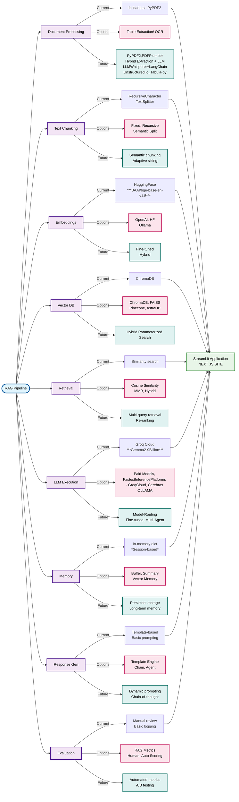

```mermaid
flowchart LR
    %% Main pipeline steps - RAG Architecture Overview
    START([RAG Pipeline]) --> PROCESS[Document Processing]
    START --> CHUNK[Text Chunking]
    START --> EMB[Embeddings]
    START --> VDB[Vector DB]
    START --> RETR[Retrieval]
    START --> LLM[LLM Execution]
    START --> MEM[Memory]
    START --> RESP[Response Gen]
    START --> EVAL[Evaluation]

    %% ######################################################################################
    %% 1 DOCUMENT PROCESSING - Extract text from various document formats
    %% ######################################################################################
    PROCESS --> |Current| DOC_C[lc.loaders i PyPDF2]
    PROCESS --> |Options| DOC_O[Table Extraction/ OCR]
    PROCESS --> |Future| DOC_F[PyPDF2,PDFPlumber <br/>Hybrid Extraction + LLM<br/>LLMWhisperer+LangChain <br/>Unstructured.io, Tabula-py]

    %% ######################################################################################
    %% 2 TEXT CHUNKING - Split documents into manageable chunks ---
    %% ######################################################################################
    CHUNK --> |Current| CHUNK_C[RecursiveCharacter <br/>TextSplitter]
    CHUNK --> |Options| CHUNK_O[Fixed, Recursive<br/>Semantic Split]
    CHUNK --> |Future| CHUNK_F[Semantic chunking<br/>Adaptive sizing]

    %% ######################################################################################
    %% 3 EMBEDDINGS - Convert text chunks to vector representations
    %% ######################################################################################
    EMB --> |Current| EMB_C[HuggingFace<br/>***BAAI/bge-base-en-v1.5***]
    EMB --> |Options| EMB_O[OpenAI, HF<br/>Ollama]
    EMB --> |Future| EMB_F[Fine-tuned <br/>Hybrid]

    %% ######################################################################################
    %% 4 VECTOR DATABASE - Store and index embeddings for retrieval
    %% ######################################################################################
    VDB --> |Current| VDB_C[ChromaDB]
    VDB --> |Options| VDB_O[ChromaDB, FAISS<br/>Pinecone, AstraDB]    
    VDB --> |Future| VDB_F[Hybrid Parameterized Search]

    %% ######################################################################################
    %% 5 RETRIEVAL - Find relevant documents based on query
    %% ######################################################################################
    RETR --> |Current| RETR_C[Similarity search]
    RETR --> |Options| RETR_O[Cosine Similarity<br/>MMR, Hybrid]
    RETR --> |Future| RETR_F[Multi-query retrieval<br/>Re-ranking]

    %% ######################################################################################
    %% 6 LLM EXECUTION - Generate responses using retrieved context
    %% ######################################################################################
    LLM --> |Current| LLM_C[Groq Cloud<br/>***Gemma2-9Billion***]
    LLM --> |Options| LLM_O[Paid Models, FastestInferencePlatforms - GroqCloud, Cerebras <br/>OLLAMA]
    LLM --> |Future| LLM_F[Model-Routing<br/>Fine-tuned, Multi-Agent]

    %% ######################################################################################
    %% 7 MEMORY - Maintain conversation context and history
    %% ######################################################################################
    MEM --> |Current| MEM_C[In-memory dict<br/>*Session-based*]
    MEM --> |Options| MEM_O[Buffer, Summary<br/>Vector Memory]
    MEM --> |Future| MEM_F[Persistent storage<br/>Long-term memory]

    %% ######################################################################################
    %% 8 RESPONSE GENERATION - Format and structure final outputs
    %% ######################################################################################
    RESP --> |Current| RESP_C[Template-based<br/>Basic prompting]
    RESP --> |Options| RESP_O[Template Engine<br/>Chain, Agent]
    RESP --> |Future| RESP_F[Dynamic prompting<br/>Chain-of-thought]

    %% ######################################################################################
    %% 9 EVALUATION - Assess system performance and quality
    %% ######################################################################################
    EVAL --> |Current| EVAL_C[Manual review<br/>Basic logging]
    EVAL --> |Options| EVAL_O[RAG Metrics<br/>Human, Auto Scoring]
    EVAL --> |Future| EVAL_F[Automated metrics<br/>A/B testing]

    DOC_C --> STREAMLIT[StreamLit Application <br/>NEXT JS SITE]
    CHUNK_C --> STREAMLIT
    EMB_C --> STREAMLIT
    VDB_C --> STREAMLIT
    RETR_C --> STREAMLIT
    LLM_C --> STREAMLIT
    MEM_C --> STREAMLIT
    RESP_C --> STREAMLIT
    EVAL_C --> STREAMLIT
    
    %% Styling for different node types - Color coding for clarity
    classDef startNode fill:#e1f5fe,stroke:#01579b,stroke-width:3px,color:#000000
    classDef mainNode fill:#f3e5f5,stroke:#4a148c,stroke-width:2px,color:#000000
    classDef x fill:#e8f5e8,stroke:#388e3c,stroke-width:2px,color:#000000;    
    classDef optionsNode fill:#fce4ec,stroke:#c2185b,stroke-width:2px,color:#000000;
    classDef futureNode fill:#e0f2f1,stroke:#00695c,stroke-width:2px,color:#000000;

    %% Assign styles to nodes - Visual hierarchy and categorization
    class START startNode
    class STREAMLIT x
    class PROCESS,CHUNK,EMB,VDB,RETR,LLM,MEM,RESP,EVAL mainNode
    class DOC_C,CHUNK_C,EMB_C,VDB_C,RETR_C,LLM_C,MEM_C,RESP_C,EVAL_C currentNode
    class DOC_O,CHUNK_O,EMB_O,VDB_O,RETR_O,LLM_O,MEM_O,RESP_O,EVAL_O optionsNode
    class DOC_F,CHUNK_F,EMB_F,VDB_F,RETR_F,LLM_F,MEM_F,RESP_F,EVAL_F futureNode
```