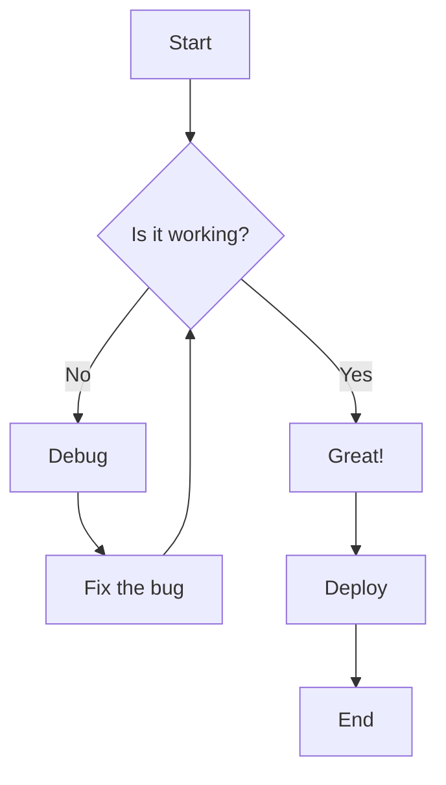
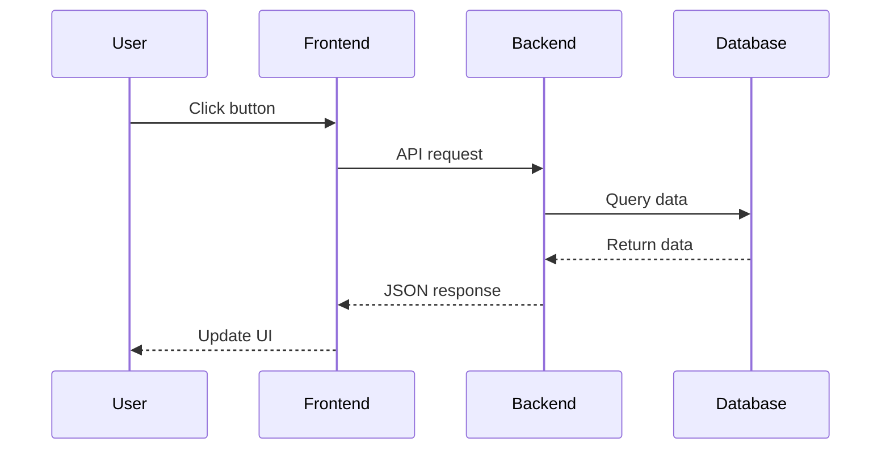
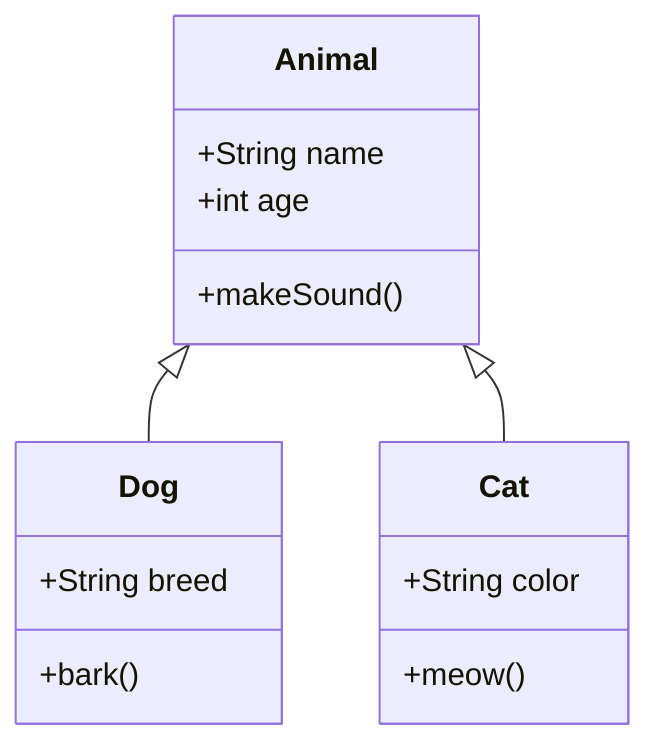
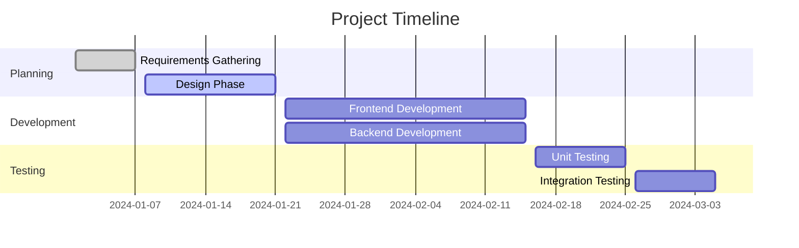
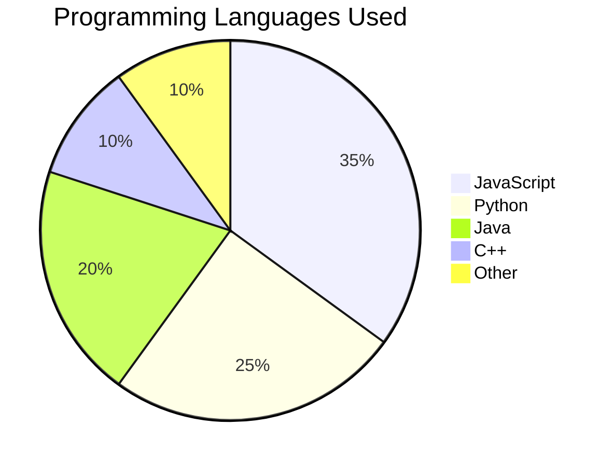
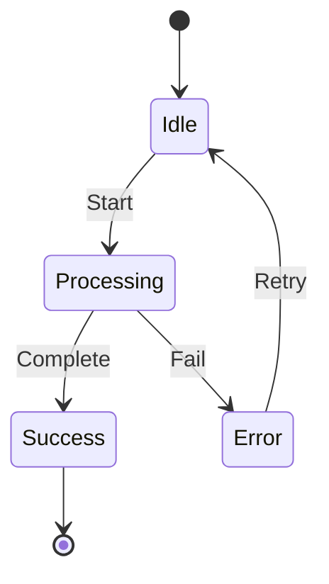
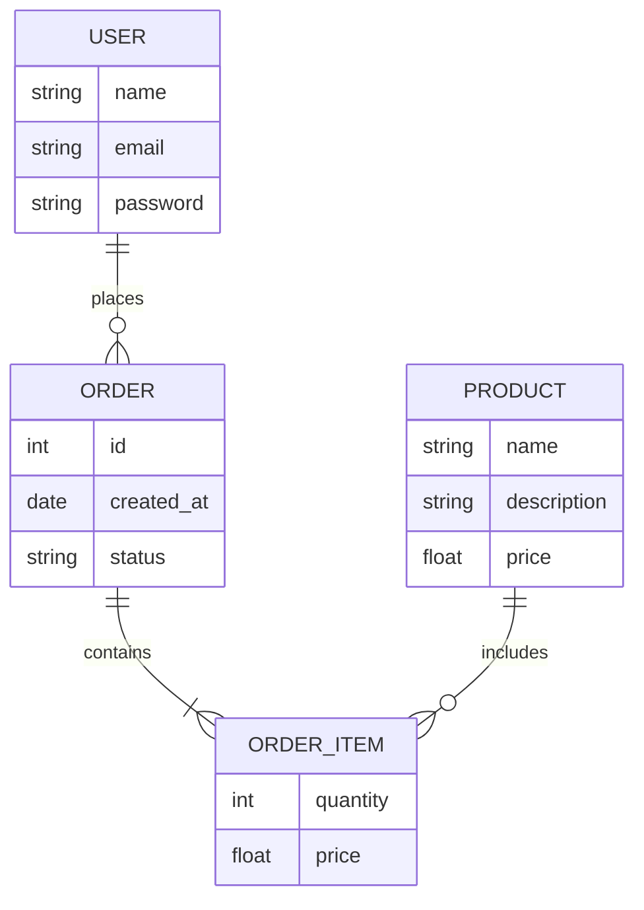
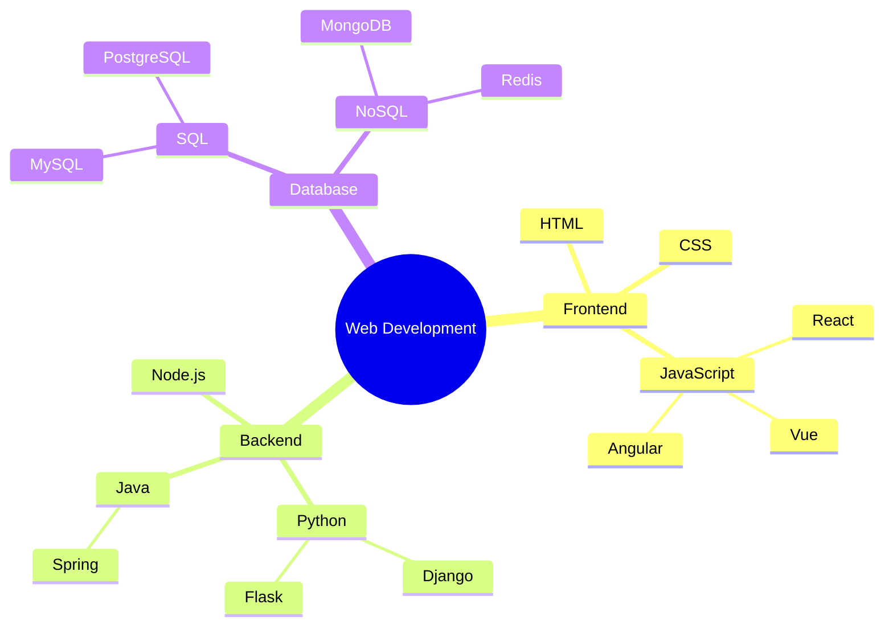
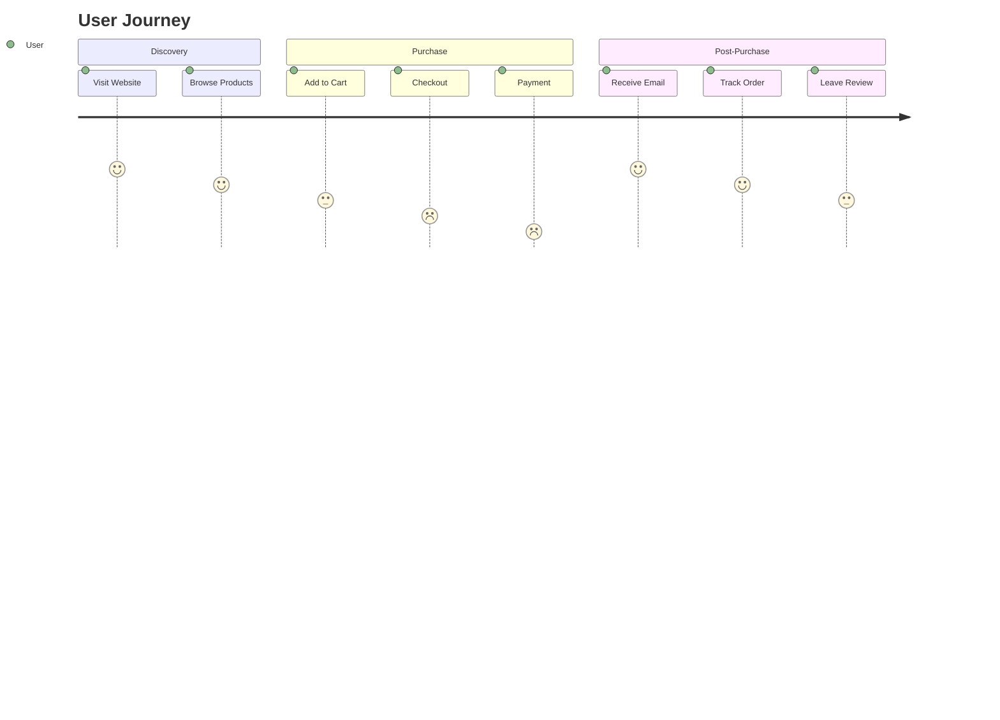

# Sample Mermaid Charts

This document contains various examples of Mermaid charts that can be rendered in Markdown.

## 1. Flowchart Example



## 2. Sequence Diagram Example



## 3. Class Diagram Example



## 4. Gantt Chart Example



## 5. Pie Chart Example



## 6. State Diagram Example



## 7. Entity Relationship Diagram Example



## 8. Mind Map Example



## 9. Git Graph Example

```mermaid
gitgraph
    commit
    branch develop
    checkout develop
    commit
    commit
    checkout main
    merge develop
    commit
```

## 10. User Journey Example



---

## Notes

- Mermaid charts are rendered automatically in many Markdown viewers including GitHub, GitLab, and many documentation platforms
- The syntax is quite intuitive and similar to other diagramming tools
- You can customize colors, styles, and layouts using Mermaid's configuration options
- These charts are great for documentation, technical specifications, and project planning
