<!-- graph TD

```mermaid
graph TD
    S5([Section 5: LangChain Hands On<br/>2h40m]):::done
    S6([Section 6: OpenAI & Ollama<br/>1h24m]):::done
    S7([Section 7: LCEL Basics<br/>49m]):::done
    S8([Section 8: AI Agents + LangChain<br/>1h16m]):::done
    S9([Section 9: AI Agents Vs Agentic AI<br/>30m]):::done
    S10([Section 10: LangGraph Start<br/>1h56m]):::large
    S11([Section 11: LangGraph Components<br/>3h19m]):::xlarge
    S12([Section 12: Debugging w/ LangSmith<br/>21m]):::tiny
    S13([Section 13: Workflows in LangGraph<br/>1h28m]):::medium
    S14([Section 14: Human In The Loop<br/>51m]):::small
    S15([Section 15: RAG with LangGraph<br/>1h43m]):::medium
    S16([Section 16: Agentic AI Projects<br/>1h51m]):::large
    S17([Section 17: Agentic Chatbot + Web Search<br/>42m]):::small
    S18([Section 18: News Summarizer<br/>50m]):::small
    S19([Section 19: Blog Gen AI App<br/>1h47m]):::large
    S20([Section 20: Model Context Protocol<br/>1h51m]):::large -->
    S5 --> S6 --> S7 --> S8
    S9 --> S10 --> S11 --> S12
    S13 --> S14 --> S15 --> S16
    S17 --> S18 --> S19 --> S20
    S8 --> S9
    S12 --> S13
    S16 --> S17

classDef tiny fill:#f2f2f2,stroke:#333,color:#000,rx:8,ry:8;
classDef small fill:#e6f7ff,stroke:#333,color:#000,rx:8,ry:8;
classDef medium fill:#cce5ff,stroke:#333,color:#000,rx:8,ry:8;
classDef large fill:#99ccff,stroke:#333,color:#000,rx:8,ry:8;
classDef big fill:#66b2ff,stroke:#333,color:#000,rx:8,ry:8;
classDef xlarge fill:#3399ff,stroke:#fff,color:#fff,rx:8,ry:8;

%% ✅ Completed chapters
classDef done fill:#a8e6a3,stroke:#2e7d32,color:#000,rx:8,ry:8;
```

    S5([Section 5: LangChain Hands On 2h40m]):::big
    S6([Section 6: OpenAI & Ollama 1h24m]):::medium
    S7([Section 7: LCEL Basics 49m]):::small
    S8([Section 8: AI Agents + LangChain 1h16m]):::medium
    S9([Section 9: AI Agents Vs Agentic AI 30m]):::tiny
    S10([Section 10: LangGraph Start 1h56m]):::large
    S11([Section 11: LangGraph Components 3h19m]):::xlarge
    S12([Section 12: Debugging w/ LangSmith 21m]):::tiny
    S13([Section 13: Workflows in LangGraph 1h28m]):::medium
    S14([Section 14: Human In The Loop 51m]):::small
    S15([Section 15: RAG with LangGraph 1h43m]):::medium
    S16([Section 16: Agentic AI Projects 1h51m]):::large
    S17([Section 17: Agentic Chatbot + Web Search 42m]):::small
    S18([Section 18: News Summarizer 50m]):::small
    S19([Section 19: Blog Gen AI App 1h47m]):::large
    S20([Section 20: Model Context Protocol 1h51m]):::large  -->

    S5 --> S6 --> S7 --> S8 --> S9 --> S10 --> S11 --> S12 --> S13 --> S14 --> S15 --> S16 --> S17 --> S18 --> S19 --> S20

<!-- classDef tiny fill:#f2f2f2,stroke:#333,color:#000,rx:50,ry:50;
classDef small fill:#e6f7ff,stroke:#333,color:#000,rx:50,ry:50;
classDef medium fill:#cce5ff,stroke:#333,color:#000,rx:50,ry:50;
classDef large fill:#99ccff,stroke:#333,color:#000,rx:50,ry:50;
classDef big fill:#66b2ff,stroke:#333,color:#000,rx:50,ry:50;
classDef xlarge fill:#3399ff,stroke:#fff,color:#fff,rx:50,ry:50;

%% ✅ Completed chapters
classDef done fill:#a8e6a3,stroke:#2e7d32,color:#000,rx:50,ry:50; -->